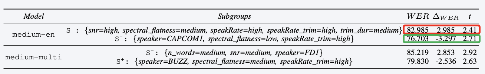
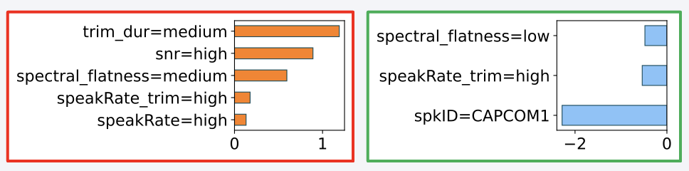
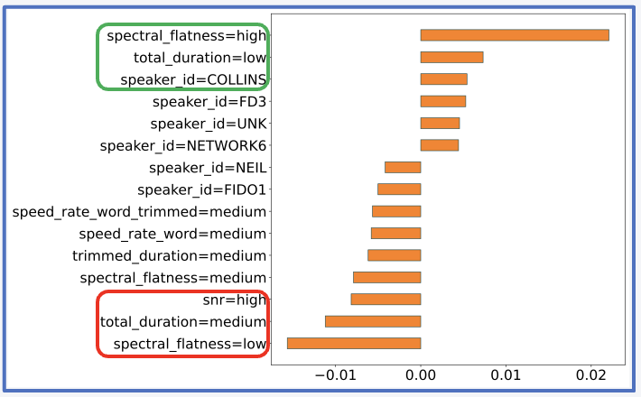
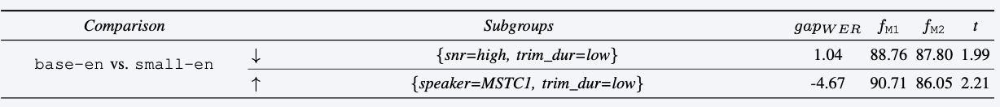
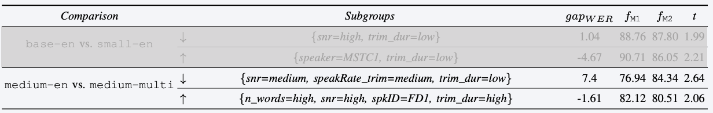
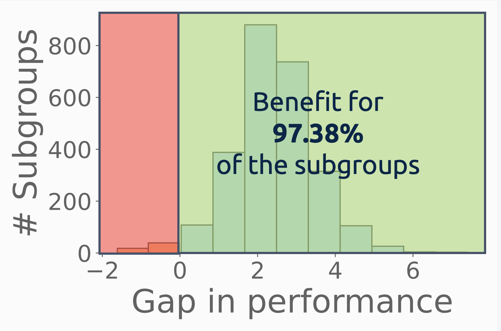
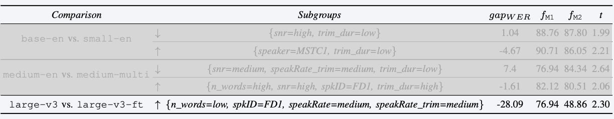

# 👨‍🚀 Houston we have a Divergence: A Subgroup Performance Analysis of ASR Models 👨‍🚀
This repo contains the code for **"Houston we have a Divergence: A Subgroup Performance Analysis of ASR Models"**, accepted at the [Fearless Steps APOLLO Workshop](https://fearless-steps.github.io/Fearless-Steps-Workshop/), ICASSP 2024.

## Running the Experiments
Use the `asr/asr.py` code to train the ASR models on the dataset, and `asr/inference.py` to run the inference of the selected models.

To reproduce the experiments of the paper, you can run the `analysis/divexplorer_analysis.ipynb` notebook, which needs the output of the inference step. 

### Dataset
We evaluate our approach on [Fearless Steps APOLLO corpus, Phase 3](https://tsapps.nist.gov/publication/get_pdf.cfm?pub_id=932307). Please refer to the official paper for more information on this dataset.

### Metadata
For the above dataset we consider factors related to speaking and recording conditions (e.g., duration of silences, number of words, speaking rate, noise level, spectral flatness) when using DivExplorer for automatically extract subgroups.  
We discretize continuous metadata using frequency-based discretization into three distinct ranges, labeled as "low", "medium", and "high". 

### Models
We employ the transformer-based whisper models in different sizes (base, small, medium, large), both multi- and mono-lingual, in two different settings: zero-shot and fine-tuning.  
The pre-trained checkpoints of these models are obtained from the [Hugging Face hub](https://huggingface.co/models). 

------------------ 

## What you can do
You can investigate the sources of errors for a model (i.e., whisper medium), and highlight the subgroups with the highest negative (or positive) divergence, as shown here:

You can also retrieve within such subgroups the items that most contribute to the increase (or decrease) in performance, by leveraging the concept of Shaplye values, as shown in the following image:

You can exploit the global Shapley values to investigate the impact of the items on the performance of the model. For example, the following image shows the top-15 items that have the highest impact on the performance in the whisper base.en model:

You can also investigate the gain in performance at the subgroup-level when scaling up the model size (i.e., whisper base to whisper small). For example, the following table shows the subgroups that most benefit or fail to benefit when changing these two models:

But you can even retrieve the subgroups that most benefit (or fail to benefit) when considering a multi-lingual instead of a mono-lingual model (e.g., whisper base.en vs. whisper base), as shown in this table: 

The following image depicts the subgroup distribution of such gains in performance when changing the model from whisper medium.en to whisper medium:

Finally, you can investigate the impact of the fine-tuning procedure at the subgroup level. For example, the following table highlights the subgroup with the maximum positive gain when considering the whisper large-v3 fine-tuned model vs. its zero-shot counterpart:

Please note that, for this model, there are no subgroups with a negative gain in performance, i.e., all subgroups benefit from the fine-tuning procedure.

## License
This code is released under the Apache 2.0 license. See the [LICENSE](LICENSE) file for more details.

## Contact
For any question, please contact [Alkis Koudounas](mailto:alkis.koudounas@polito.it).